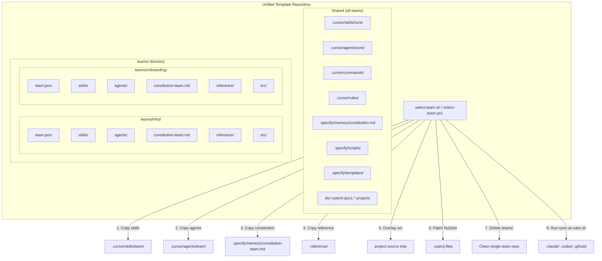

# eToro Unified Template — Backend API

A unified, multi-team SpecKit-powered template for creating new eToro backend API services. Contains shared architecture (Clean Architecture, multi-IDE support, SpecKit workflow) plus team-specific AI skills, agents, NuGet packages, and reference implementations — all selectable with a single command.

## Quick Start

### 1. Generate the Project (Cookiecutter)

```bash
# Install Cookiecutter if needed
pip install cookiecutter

# Generate your service (run from any directory)
cookiecutter https://github.com/eToro/etoro-sdd-template-api

# Or from a local clone
cookiecutter /path/to/etoro-sdd-template-api
```

You will be prompted for:
- `project_name` — the C# namespace root for your service (e.g. `MyService`, `Payments.Gateway`)

This generates a `<project_name>/` folder with all names substituted. `cd` into it.

### 2. Select Your Team

```bash
# See available teams
make list-teams

# Materialize the template for your team (ONE-TIME, destructive)
make select-team TEAM=infra        # Infrastructure team
make select-team TEAM=onboarding   # Onboarding team

# Preview changes without writing
make select-team-dry-run TEAM=infra
```

**What `select-team` does:**
1. Copies team-specific AI skills, agents, and constitution into `.cursor/`
2. Copies team-specific `.reference/` implementations
3. Overlays team-specific source files (KEEP files) into project tree
4. Replaces NuGet packages in all `.csproj` files with team-specific versions
5. Removes the `teams/` directory and `teams.json` (no longer needed)
6. Runs `sync-ai-rules.sh` to generate multi-IDE outputs (`.claude/`, `.codex/`, `.github/`)

After running, the repo is a standard single-team template ready for project setup.

### 3. SpecKit Workflow

```text
/speckit.specify   →  Create feature spec (specs/###-feature/spec.md)
/speckit.clarify   →  Resolve ambiguities in the spec
/speckit.plan      →  Generate implementation plan (plan.md, research.md, data-model.md, contracts/)
/speckit.tasks     →  Break plan into implementation tasks (tasks.md)
/speckit.analyze   →  Validate consistency across spec, plan, and tasks
/speckit.implement →  Execute tasks with specialized agents
```

## Available Teams

| ID | Name | NuGet Stack | Key Patterns |
|----|------|-------------|-------------|
| `infra` | Infrastructure | `eToro.Infrastructure.*` | PolicyRestProviderBase, STS auth, CCM ConfigurationProvider, Polly circuit breaker |
| `onboarding` | Onboarding | `eToro.Onboarding.Extensions.*` | IRestApiClient, FluentValidation, ExtendedControllerBase, ConfigureWithRefresh |

## Architecture

### Select-Team Flow



### Clean Architecture Layers

```text
Api (Controllers, DTOs, Validation, Swagger)
  └── Application (Services, MonitorWrapper, Jobs, Cache, Events)
        ├── Domain (Enumerations only)
        └── Infrastructure (Providers, Repositories, Configuration)
```

| Layer | Responsibility |
|-------|---------------|
| **Api** | Controllers, request/response DTOs, validation (`ErrorCode`, `ErrorMessageConsts`, `FieldsMaxLength`), Swagger docs, `Internalize()`/`Externalize()` extensions |
| **Application** | Business logic services with `MonitorWrapper`, static cache loader jobs, event publishing, dedicated Parameters/Results/Data DTOs, application exceptions |
| **Domain** | Enumerations only -- business concepts like `ResourceStatus`, `ApplicationType` |
| **Infrastructure** | REST providers (circuit breaker), Cosmos DB/MSSQL repositories, `ConfigurationProvider` (CCM), provider DTOs |

### Two-Tier AI Knowledge

The AI tooling uses a **core + team** architecture:

- **Core** (`.cursor/skills/core/`, `.cursor/agents/core/`) — Shared Clean Architecture patterns, API design, monitoring, testing conventions. These are the same for all teams.
- **Team** (`.cursor/skills/team/`, `.cursor/agents/team/`) — NuGet-specific patterns, library APIs, team conventions. These differ per team and are populated by `select-team`.

### Supported IDEs

| IDE / Agent | Commands Location | Context File |
|-------------|-------------------|--------------|
| **Cursor** | `.cursor/commands/` (canonical) | Rules in `.cursor/rules/` |
| **Claude Code** | `.claude/commands/` (generated) | `CLAUDE.md` |
| **Codex** | `.codex/commands/` (generated) | `AGENTS.md` |
| **GitHub Copilot** | `.github/instructions/` (generated) | `.github/agents/` |

Run `make sync-rules` to regenerate IDE-specific files from `.cursor/` canonical source.

## Template Structure (Before Team Selection)

```
.
├── teams.json                              # Team registry
├── teams/
│   ├── infra/                              # Infrastructure team content
│   │   ├── team.json                       # NuGets, MCPs, metadata
│   │   ├── skills/                         # Team-specific AI skills
│   │   ├── agents/                         # Team-specific AI agents
│   │   ├── constitution-team.md            # Team constitution
│   │   ├── reference/                      # Reference implementations
│   │   └── src/                            # KEEP files (source overlay)
│   └── onboarding/                         # Onboarding team content
│       └── (same structure)
├── .cursor/
│   ├── skills/core/                        # Shared architecture skills
│   ├── agents/core/                        # Shared architecture agents
│   ├── commands/                           # SpecKit commands
│   └── rules/                             # IDE rules
├── .specify/
│   ├── memory/constitution.md              # Core constitution
│   ├── scripts/                            # Shell + PowerShell scripts
│   └── templates/                          # SpecKit templates
├── .ai-rules.json                          # Multi-IDE sync config
├── Makefile                                # Build targets
├── dor-cytech-poc1.Api/
├── dor-cytech-poc1.Application/
├── dor-cytech-poc1.Domain/
├── dor-cytech-poc1.Infrastructure/
└── dor-cytech-poc1.Tests.*/
```

## Adding a New Team

To add support for a new team:

1. Create `teams/<team-id>/` with:
   - `team.json` — Team metadata, MCP configs, and complete NuGet package lists per project layer
   - `skills/` — Team-specific SKILL.md files (same structure as `.cursor/skills/team/`)
   - `agents/` — Team-specific agent markdown files
   - `constitution-team.md` — Team-specific constitution extending the core
   - `reference/` — Reference implementation examples organized by layer
   - `src/` — Source file overlays (KEEP files) organized by layer name (Api/, Infrastructure/, etc.)

2. Add an entry to `teams.json`

3. Commit and push

No changes needed to shared core, scripts, or Makefile.

### `team.json` Format

```json
{
  "id": "my-team",
  "name": "My Team",
  "description": "Description of the team template",
  "mcps": {
    "mcp-name": { "type": "http", "url": "http://..." }
  },
  "nugets": {
    "Api": [
      { "package": "Package.Name", "version": "1.0.0" }
    ],
    "Application": [],
    "Domain": [],
    "Infrastructure": [],
    "Tests.Component": [],
    "Tests.System": []
  }
}
```

The `nugets` section specifies the **complete** package list per project layer. Empty arrays (`[]`) remove all PackageReference entries from that project's .csproj.

## How `select-team` Works (Detailed)

The `select-team.sh` script (and its PowerShell equivalent `select-team.ps1`) performs a one-time, destructive transformation:

1. **Validate** -- Confirms the team ID exists in `teams/` and has a valid `team.json`
2. **Copy AI content**:
   - `teams/{id}/skills/*` --> `.cursor/skills/team/`
   - `teams/{id}/agents/*` --> `.cursor/agents/team/`
   - `teams/{id}/constitution-team.md` --> `.specify/memory/constitution-team.md`
   - `teams/{id}/reference/*` --> `.reference/`
3. **Overlay source** -- Copies `teams/{id}/src/*` into the project tree, mapping layer names to project directories (e.g., `src/Infrastructure/...` --> `dor-cytech-poc1.Infrastructure/...`)
4. **Patch NuGets** -- Reads `team.json` nugets section and replaces `<PackageReference>` blocks in each `.csproj` file. If a project has no existing PackageReference group, one is inserted. Empty arrays remove all packages.
5. **Cleanup** -- Removes `teams/` directory and `teams.json`
6. **Sync IDEs** -- Runs `sync-ai-rules.sh` to generate `.claude/`, `.codex/`, `.github/` from `.cursor/` canonical source
7. **Report** -- Prints summary and next steps

After completion, the repo looks identical to a single-team template -- no trace of other teams.

## Make Targets

| Target | Description |
|--------|-------------|
| `make select-team TEAM=<id>` | Materialize template for a team (one-time) |
| `make select-team-dry-run TEAM=<id>` | Preview team materialization |
| `make list-teams` | List available teams |
| `make sync-rules` | Regenerate IDE files from `.cursor/` |
| `make sync-rules-dry-run` | Preview sync output |
| `make sync-rules-clean` | Remove all generated IDE files |


## Scripts Reference

| Script | Platform | Purpose |
|--------|----------|---------|
| `.specify/scripts/sh/select-team.sh` | macOS/Linux | Team materialization |
| `.specify/scripts/powershell/select-team.ps1` | Windows | Team materialization |
| `.specify/scripts/sh/sync-ai-rules.sh` | macOS/Linux | Multi-IDE rule generation from `.cursor/` |
| `.specify/scripts/powershell/sync-ai-rules.ps1` | Windows | Multi-IDE rule generation from `.cursor/` |

